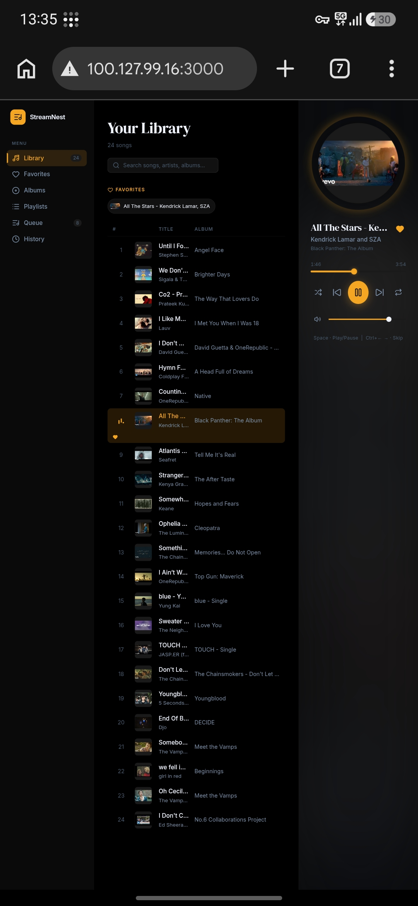

# StreamNest 🎵

> A self-hosted music streaming platform that transforms an Android phone into a personal music server.

Stream your music collection from anywhere in the world using a lightweight Spring Boot backend, a React Progressive Web App (PWA), and secure networking through Tailscale.

---

# Features

## Music Library

* Automatic music library scanning
* MP3 metadata extraction
* Album, artist, and title detection
* Embedded album artwork extraction
* Dynamic library refresh

## Audio Streaming

* HTTP audio streaming
* Browser-based playback
* Queue management
* Next / Previous controls
* Shuffle mode
* Repeat mode
* Seek controls
* Volume controls

## User Experience

* Modern React interface
* Progressive Web App (PWA)
* Installable on Android
* Search songs instantly
* Artist browsing
* Album browsing
* Playback history
* Favorite songs support

## Remote Access

* Secure Tailscale networking
* Access music from anywhere
* No port forwarding required
* End-to-end encrypted connections

---

# Architecture

```text
                          Internet
                              │
                              ▼
                        Tailscale VPN
                              │
                              ▼
                      Android Phone
                    (24/7 Music Server)
                              │
         ┌────────────────────┴────────────────────┐
         │                                         │
         ▼                                         ▼
   Spring Boot Backend                     Music Library
        Port 8080                           MP3 Files
         │
         ▼
      REST APIs
         │
         ▼
   React PWA Frontend
      Port 3000
         │
         ▼
       Browser
       Mobile
       Desktop
```

---

# Desktop Screenshots

Create the following folder:

```text
screenshots/
├── desktop-home.png
├── desktop-player.png
└── desktop-library.png
```

### Home Screen


### Music Player


### Library View


---

# Android Screenshots

Create the following folder:

```text
screenshots/
├── android-home.jpg
├── android-player.jpg
└── android-library.jpg
```

### Android Home



### Android Player


### Android Library


---

# Tech Stack

## Backend

* Java 23
* Spring Boot 3
* Maven
* Apache Tomcat

## Frontend

* React
* TypeScript
* Vite
* Progressive Web App (PWA)
* Lucide Icons

## Mobile Deployment

* Android
* Termux
* Java Runtime

## Networking

* Tailscale

---

# API Endpoints

## Health Check

```http
GET /api/health
```

Response:

```json
{
  "status": "ok",
  "service": "StreamNest",
  "version": "1.0.0"
}
```

---

## List Songs

```http
GET /api/songs
```

Returns all scanned songs with metadata.

---

## Stream Song

```http
GET /api/stream/{filename}
```

Streams audio content.

---

## Album Artwork

```http
GET /api/artwork/{songId}
```

Returns embedded album artwork.

---

# Local Development

## Backend

```bash
cd backend
./mvnw spring-boot:run
```

Server:

```text
http://localhost:8080
```

---

## Frontend

```bash
cd frontend

npm install
npm run dev
```

Server:

```text
http://localhost:5173
```

---

# Production Build

## Frontend

```bash
cd frontend

npm run build
```

Generated output:

```text
frontend/dist
```

---

## Backend

```bash
cd backend

./mvnw clean package
```

Generated output:

```text
backend/target/backend-0.0.1-SNAPSHOT.jar
```

---

# Android Deployment

## Folder Structure

```text
Phone/
└── StreamNest/
    ├── backend/
    │   └── streamnest.jar
    │
    └── music/
        ├── song1.mp3
        ├── song2.mp3
        └── ...
```

---

## Start Backend

```bash
cd ~/storage/shared/StreamNest/backend

java -jar streamnest.jar
```

---

## Verify Backend

```text
http://PHONE_IP:8080/api/health
```

---

## Verify Frontend

```text
http://PHONE_IP:3000
```

---

# Remote Access via Tailscale

Install Tailscale on:

* Android Server
* Laptop/Desktop
* Mobile Client Devices

After joining the same Tailnet:

```text
http://TAILSCALE_IP:3000
```

Example:

```text
http://100.x.x.x:3000
```

Backend:

```text
http://100.x.x.x:8080
```

No port forwarding required.

---

# Project Status

## Phase 1 — Backend MVP

* ✅ Spring Boot Setup
* ✅ Health Endpoint
* ✅ Music Scanner
* ✅ Metadata Extraction
* ✅ Album Artwork Extraction
* ✅ Audio Streaming API

---

## Phase 2 — Frontend

* ✅ React + Vite
* ✅ TypeScript
* ✅ Audio Player
* ✅ Queue System
* ✅ Search
* ✅ Favorites
* ✅ Playback History
* ✅ Shuffle
* ✅ Repeat
* ✅ PWA Support

---

## Phase 3 — Android Deployment

* ✅ Spring Boot JAR Build
* ✅ Android Deployment
* ✅ Termux Setup
* ✅ Music Folder Integration
* ✅ Mobile Browser Testing

---

## Phase 4 — Global Access

* ✅ Tailscale Setup
* ✅ Remote Streaming
* ✅ Global Accessibility
* ✅ Cross-device Playback

---

# Current Release

## Version 1.0.0

Status:

```text
Stable
```

### Included Features

* Music library management
* Audio streaming
* Album artwork support
* Search
* Queue management
* Android deployment
* Remote access through Tailscale
* Progressive Web App (PWA)

---

# Roadmap

## Version 1.1

### Quality Improvements

* [ ] Mobile responsive UI
* [ ] Better tablet layouts
* [ ] Persistent playlists
* [ ] Recently played section
* [ ] Library refresh button
* [ ] Better artwork fallback handling

---

## Version 2.0

### Native Android Application

Move from a browser-based PWA to a dedicated Android application.

### Planned Stack

* Kotlin
* Jetpack Compose
* Material 3

### Features

* [ ] Native Android UI
* [ ] Background playback
* [ ] Android notifications
* [ ] Lock screen controls
* [ ] Offline caching
* [ ] Download songs
* [ ] Native media session integration
* [ ] Android Auto support

---

## Version 2.5

### Multi-Device Streaming

* [ ] Multiple concurrent clients
* [ ] Shared libraries
* [ ] Remote queue management
* [ ] Device synchronization

---

## Version 3.0

### Intelligent Music Platform

* [ ] AI Playlist Generation
* [ ] Recommendation Engine
* [ ] Similar Song Discovery
* [ ] Mood-Based Music Suggestions
* [ ] Natural Language Search
* [ ] Voice Commands

### Potential Technologies

* Spring AI
* LangChain
* Local LLM Integration
* Vector Databases

---

# Long-Term Vision

Create a fully self-hosted music ecosystem that combines:

* Spotify-like user experience
* Plex-style ownership
* Android-first deployment
* AI-powered discovery
* Complete user control

without requiring subscriptions, cloud hosting, or third-party music services.

---

# 📄 License

This project is licensed under the MIT License.

Feel free to fork, modify, and build upon it.
screenshots